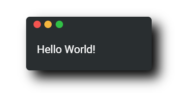
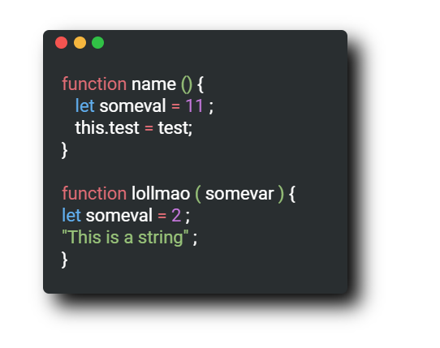

# Snippet library

A small JS library that can be used to embed code snippets on a website.

Document projects in a more visually appealing way than a simple Readme. Implemented using vanilla Javascript and CSS to ensure universal 
compatibility.



Includes automatic parsing and coloring of included code.



# Installation

Download the release package of the library and place the `code-snippets` folder in the source directory of your project.

link both the Javascript and CSS files to your project as follows:

```HTML
<link rel="stylesheet" href="./code-snippets/snippets.css">
```
```HTML
<script src="./code-snippets/snippets.js"></script>
```

# Usage

First an instance of the library must be created.

```javascript
let snippets = new Snippets();
```

Snippet tags can then be added anywhere on the pages HTML

```HTML
<snippet></snippet>
```
Text can then be added to each subsequent snippet using either the `Snippets.addSnippetString(string)` or `Snippets.addSnippetStrings([string])`
methods.

finally make a call to `Snippets.createSnippets()` to create the snippets


# Todo

- Improve text parsing in order to more accurately color code
- Add additional and customizable themes for border styling 
- Add support for languages other than Javascript
- Add animations to make snippets more dynamic and interactive
- Integration into frameworks such as React

